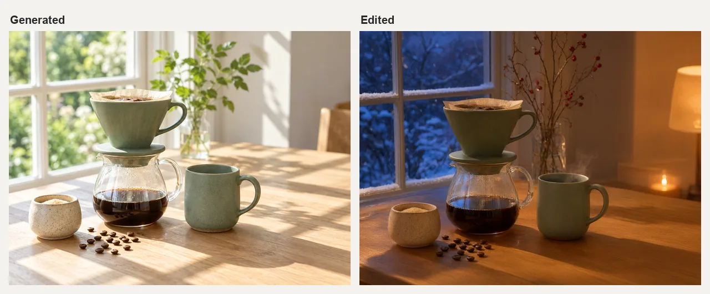
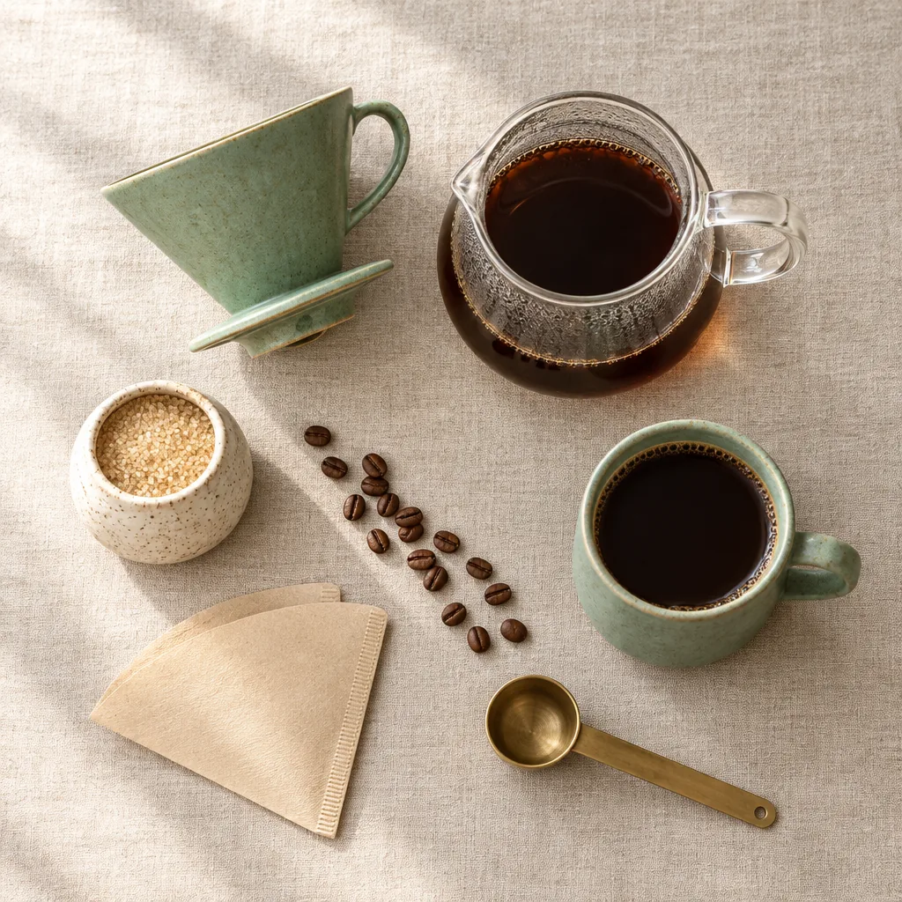

# AI Image Generator Skill

[English](./README.md) | 简体中文

生成、合成并编辑产品图、品牌视觉、海报、社交媒体配图、插画和照片的不同版本，在 Claude Code、Codex 或 OpenClaw 里直接完成。

> [!IMPORTANT]
> 生成需要 [Beatra](https://beatra.ai) 账号并消耗积分，安装本身不收费。

| 问题 | 回答 |
| --- | --- |
| **能做什么** | 生成、合成并编辑产品图、品牌视觉、海报、社交媒体配图、插画和照片的不同版本。 |
| **运行要求** | Python 3.10+，以及能加载 `SKILL.md` 的 Agent |
| **费用** | 安装免费。每次生成消耗 Beatra 账号积分，只有你明确要求这次生成或批准确认卡后才会付费。 |
| **支持的 Agent** | Claude Code、Codex、OpenClaw |

<p align="center"></p>

*先生成一张夏日阳光下的虚构鼠尾草绿陶瓷手冲咖啡套装照片，再把同一张图编辑成下雪的冬夜灯光场景，器具和摆放位置保持不变。由 Beatra AI 生成。*

| Skill | Entry point | Version |
| --- | --- | --- |
| [`ai-image-generation-studio`](skills/ai-image-generation-studio) | [SKILL.md](skills/ai-image-generation-studio/SKILL.md) | 0.1.7 |

本仓库由 [beatra-ai/beatra-skills](https://github.com/beatra-ai/beatra-skills/tree/main/skills/ai-image-generation-studio) 自动发布，问题请到那里反馈。

## 安装

使用 [`skills`](https://skills.sh) CLI：

```bash
npx skills add beatra-ai/ai-image-generator-skill
```

使用 GitHub CLI：

```bash
gh skill install beatra-ai/ai-image-generator-skill ai-image-generation-studio
```

也可以克隆本仓库，把 `skills/ai-image-generation-studio` 复制到 `~/.claude/skills/`（Claude Code）、`~/.agents/skills/`（Codex）或 `~/.openclaw/skills/`（OpenClaw）。

或者把下面这段话发给你的 Agent：

```text
从 https://github.com/beatra-ai/ai-image-generator-skill 安装 ai-image-generation-studio skill（目录 skills/ai-image-generation-studio），然后按它的 SKILL.md 连接我的 Beatra 账号。
```

## 效果示例

<p align="center"></p>

*把生成的手冲套装作为参考图，重新构图成一张亚麻桌布上的方形俯拍平铺图，搭配咖啡豆、滤纸和黄铜量勺。由 Beatra AI 生成。*

提示词：

```text
New composition for a square social media post. Image 1 is the product reference: the sage-green ceramic pour-over dripper, the glass carafe, the sage-green mug and the speckled cream sugar bowl. Keep their shapes, glaze colors, speckled texture and proportions recognizable. Arrange them as a top-down overhead flat lay on a textured natural linen tablecloth: the dripper lying beside the carafe, the mug filled with black coffee seen from directly above, the sugar bowl, a small scattered line of whole coffee beans, a folded unbleached paper filter, and a brass coffee scoop. Soft even daylight from the upper left with gentle short shadows, calm balanced spacing between objects with breathing room around the edges, muted sage, cream, linen and warm brown palette, photoreal editorial product photography. No people, no hands, no text, no logos, no labels, no watermarks.
```

## 你能得到什么

- **先明确方向，再开始生成** — 开始生成前先确定信息、主体、构图、风格、光线、配色、发布场景和必须保留的内容。
- **从真正重要的素材开始** — 使用文字描述、按顺序提供的一至四张参考图或一张原图，并沿用你选择的起点。
- **制作下一版前先看结果** — 检查生成的图像后，再选择一次局部修改、重新构图或重新生成。

## 适用场景

- **制作产品图** — 把已有产品放进新场景，或生成新的产品概念图，再检查外形、颜色、标签与发布场景。
- **制作广告与品牌视觉** — 围绕一条信息、一个配色方案和目标受众，制作广告图或品牌视觉草稿。
- **制作社交媒体配图与海报** — 根据发布渠道、横竖方向、文字要放的位置和想传达的信息，规划一张图。
- **创作插画与概念图** — 用明确的视觉风格探索插画、封面、场景或概念图。
- **修改照片或背景** — 以已有图像为原图，把修改重点放在指定的物体、区域、背景或整体效果上，并检查整张结果。
- **用参考图创作新图** — 按顺序使用产品、主体、风格或场景参考图来创作新图，再检查哪些特征被保留下来。

## 常见问题

### 这个工作室能做什么？

它可以从文字、参考图或已有原图出发，制作产品图、广告创意、品牌视觉、海报、社交媒体配图、插画、概念图、照片的不同版本和背景修改。

### 可以使用我自己的照片或产品图吗？

可以。一至四张已有图像可以按顺序引导新构图，也可以让第一张图作为需要修改的原图。生成的细节仍需检查。

### 可以只修改图片的一部分吗？

可以。局部修改会针对已有原图中的指定区域，再从主体、构图、文字和发布场景检查整张结果。

### 它使用哪些图像模型？

它会根据图像目标、参考素材、画幅、出图数量和创作设置匹配当前模型，并在指名模型适合这些输入时沿用该选择。

### 可以让一系列图片保持统一吗？

可以在系列图片中复用所选方向、文字描述、参考图、主体特征、风格、标识位置和文字计划，再逐张检查视觉一致性。

## 更新

安装后的 skill 每天最多检查一次新版本，替换前先校验官方归档，任何一步失败都不会动你已安装的版本。
随时可以关闭，见 skill 内的 `references/automatic-updates-and-safety.md`。

## 许可证

[MIT-0](LICENSE)：可自由使用、修改和再分发，包括商用，无需署名；与这些 skill 在 ClawHub 上的条款一致。
